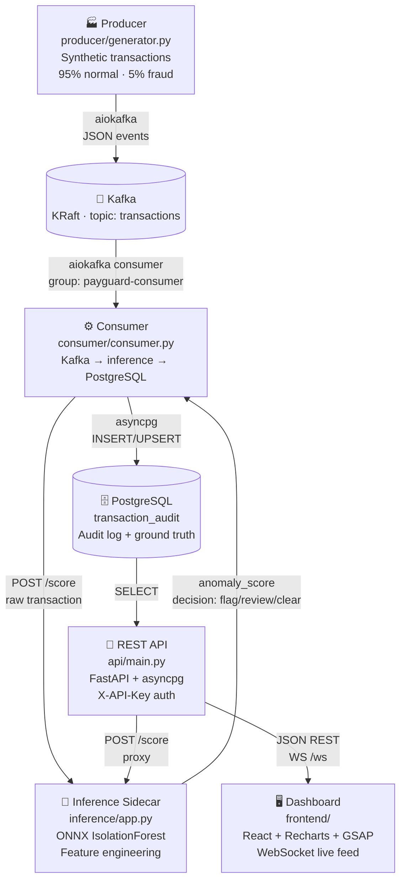
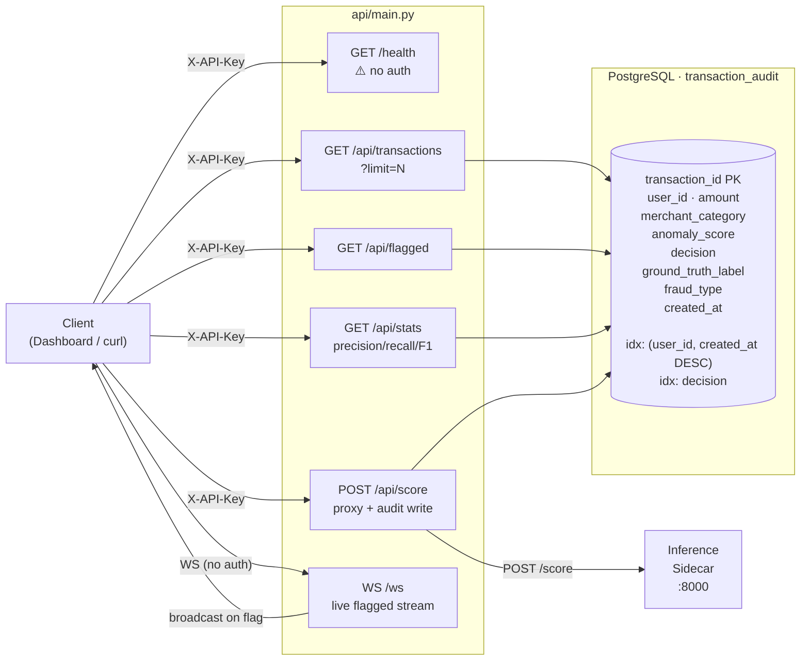
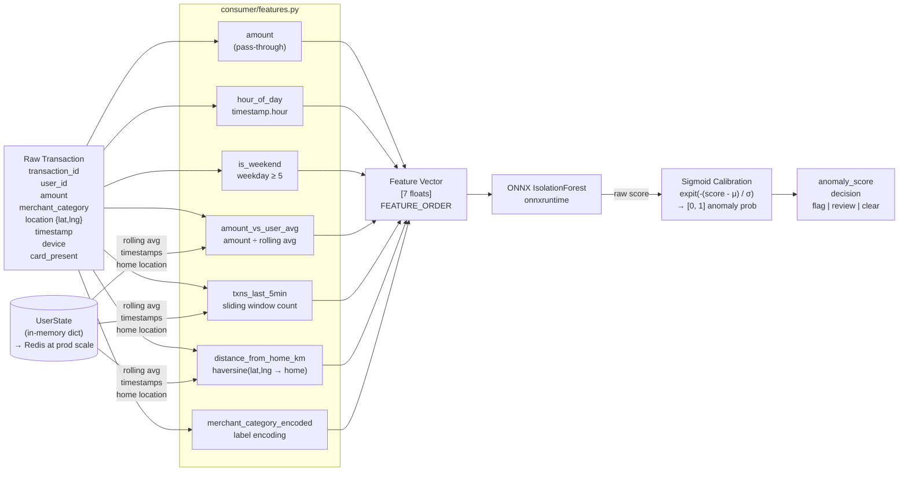
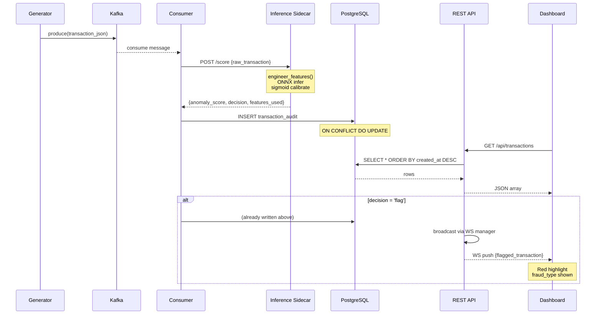

<!-- AUTO-GENERATED — do not edit manually.
     Generated by scripts/gen_architecture.py on every commit.
     View Mermaid diagrams: GitHub renders natively · VS Code: "Markdown Preview Mermaid Support" extension.
-->

# PayGuard — Architecture Reference

---

## System Overview



---

## FastAPI ↔ PostgreSQL Endpoint Map



---

## Feature Engineering Pipeline



---

## Transaction Lifecycle (sequence)



---

## Component Status

<!-- STATUS_START -->
| File | Component | Status | Size |
|------|-----------|--------|------|
| `producer/generator.py` | Synthetic transaction generator | ✅ present | 12,508 B |
| `consumer/features.py` | Feature engineering pipeline | ✅ present | 8,645 B |
| `consumer/consumer.py` | Kafka → inference → PostgreSQL consumer | ✅ present | 4,864 B |
| `ml/train.py` | IsolationForest training + ONNX export | ✅ present | 13,369 B |
| `inference/app.py` | ONNX inference sidecar (FastAPI) | ✅ present | 5,805 B |
| `api/main.py` | REST API + WebSocket (FastAPI + asyncpg) | ✅ present | 10,924 B |
| `frontend/src/App.jsx` | React dashboard | ✅ present | 8,243 B |
| `docker-compose.yml` | Container orchestration | ✅ present | 5,395 B |
| `Makefile` | Developer workflow targets | ✅ present | 2,483 B |
| `.github/workflows/ci.yml` | CI pipeline | ✅ present | 2,539 B |
_Last updated: 2026-06-04 21:49 UTC_

<!-- STATUS_END -->

---

## Project Structure

<!-- FILES_START -->
```
PayGuard/
├── api
│   ├── __init__.py
│   ├── Dockerfile
│   └── main.py
├── consumer
│   ├── __init__.py
│   ├── consumer.py
│   ├── Dockerfile
│   └── features.py
├── frontend
│   ├── src
│   │   ├── components
│   │   │   ├── FlaggedPanel.jsx
│   │   │   ├── ScoreHistogram.jsx
│   │   │   ├── StatsCounters.jsx
│   │   │   └── TransactionFeed.jsx
│   │   ├── hooks
│   │   │   ├── useCounter.js
│   │   │   ├── useMagnetic.js
│   │   │   ├── useMaskReveal.js
│   │   │   └── useWebSocket.js
│   │   ├── lib
│   │   │   ├── canvas.js
│   │   │   ├── cursor.js
│   │   │   └── motion.js
│   │   ├── styles
│   │   │   └── globals.css
│   │   ├── App.jsx
│   │   ├── index.css
│   │   └── main.jsx
│   ├── tests
│   │   ├── __mocks__
│   │   │   ├── gsap.js
│   │   │   └── lenis.js
│   │   ├── App.test.jsx
│   │   └── setupTests.js
│   ├── babel.config.cjs
│   ├── Dockerfile
│   ├── index.html
│   ├── jest.config.cjs
│   ├── nginx.conf
│   ├── package.json
│   ├── postcss.config.js
│   ├── tailwind.config.js
│   └── vite.config.js
├── inference
│   ├── __init__.py
│   ├── app.py
│   └── Dockerfile
├── ml
│   ├── __init__.py
│   └── train.py
├── producer
│   ├── __init__.py
│   ├── Dockerfile
│   └── generator.py
├── scripts
│   ├── gen_architecture.py
│   └── install_hooks.sh
├── tests
│   ├── api
│   │   ├── __init__.py
│   │   └── test_api.py
│   ├── integration
│   │   ├── __init__.py
│   │   └── test_integration.py
│   ├── ml
│   │   ├── __init__.py
│   │   └── test_model.py
│   ├── unit
│   │   ├── __init__.py
│   │   ├── test_features.py
│   │   └── test_generator.py
│   ├── __init__.py
│   └── conftest.py
├── ARCHITECTURE.md
├── docker-compose.yml
├── Makefile
├── README.md
├── requirements-dev.txt
├── requirements.txt
└── ruff.toml
```
<!-- FILES_END -->

---

> To regenerate this file: `python scripts/gen_architecture.py`  
> To install the pre-commit hook: `make setup`
